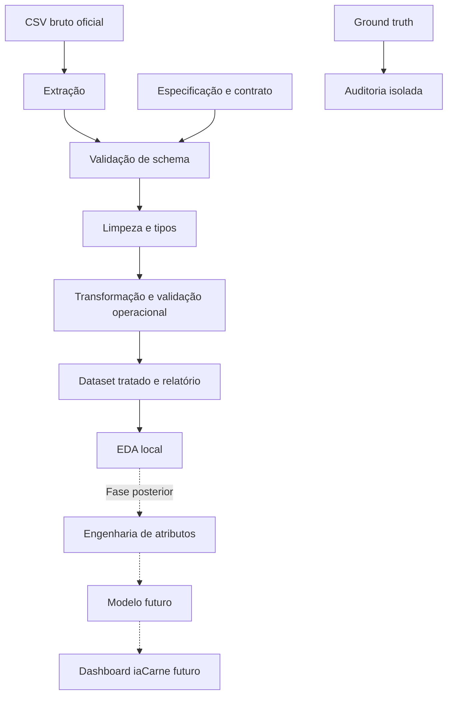

# Fluxo de dados

O ground truth não alimenta extração, transformação, EDA operacional ou atributos. A aplicação existente permanece em repositório separado, sem dependência do pipeline. Setas tracejadas representam trabalho fora da Fase 1.
