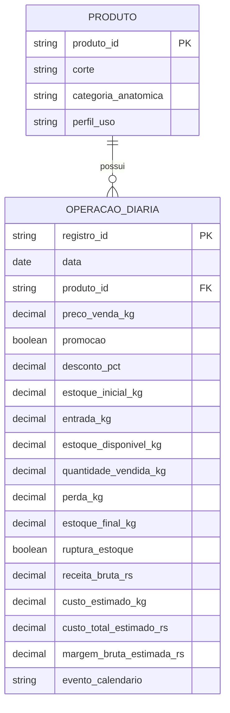

# Modelo E/R conceitual

Modelo adaptado à granularidade oficial: operação diária agregada por corte, não transação ou item de cupom. `(data, produto_id)` também é chave única. Promoção é atributo diário: não existe identificador ou campanha independente no schema, portanto não se cria entidade artificial. Vendas e saldos compartilham a mesma observação diária.

O armazenamento físico da Fase 1 é CSV desnormalizado. Campos de calendário são derivados de `data`; controles de qualidade acrescentados pelo ETL não representam entidades. Este diagrama não propõe migração do banco da aplicação existente.
