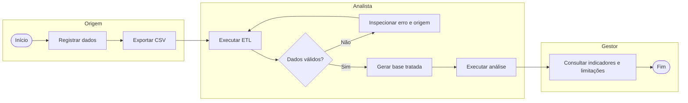
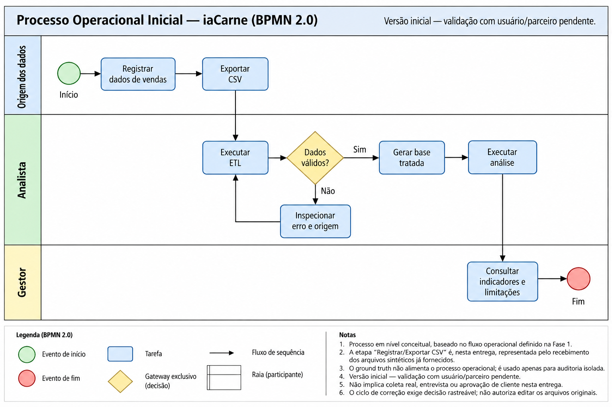

# Processo operacional inicial

**Status: versão inicial — validação com usuário/parceiro pendente.**

Fluxo conceitual com responsabilidades, inspirado em processo BPMN; não é arquivo BPMN 2.0 executável. Nesta entrega, registrar/exportar é substituído pelo recebimento dos arquivos sintéticos já fornecidos. Não implica coleta real, entrevista ou aprovação de cliente. O ciclo de correção exige decisão rastreável; não autoriza editar os originais.

## Representação visual BPMN

O PNG fornecido complementa o fluxo textual versionável acima com a representação visual BPMN inicial. Ambos descrevem o mesmo processo: o caminho de dados inválidos retorna à execução do ETL após inspeção; o caminho válido segue para base tratada, EDA e consulta dos indicadores. A etapa de origem representa o recebimento dos arquivos sintéticos nesta entrega. O [diagrama de blocos](blocos.md) descreve a arquitetura de dados, e o [E/R](entidades.md), as entidades conceituais.

**Versão inicial — validação com usuário/parceiro pendente.**
